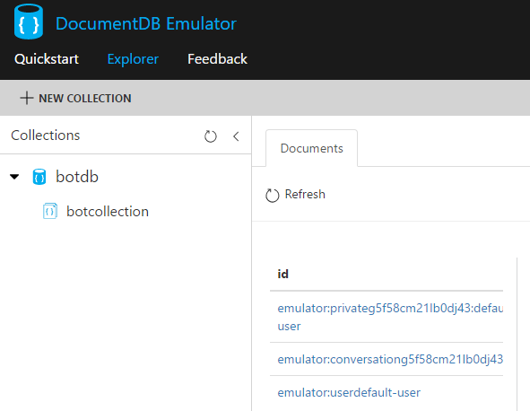
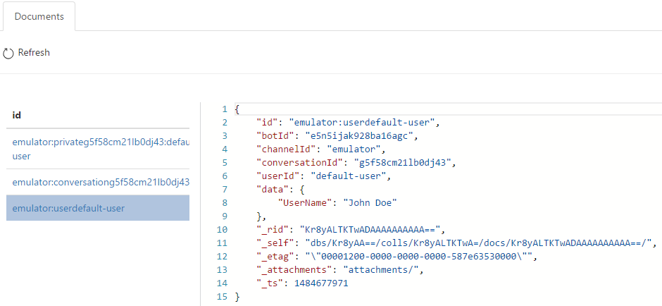
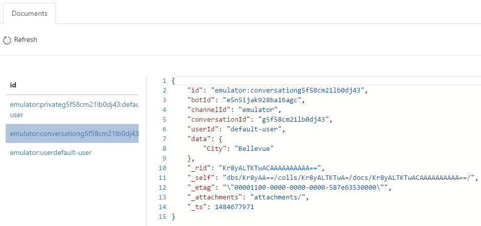
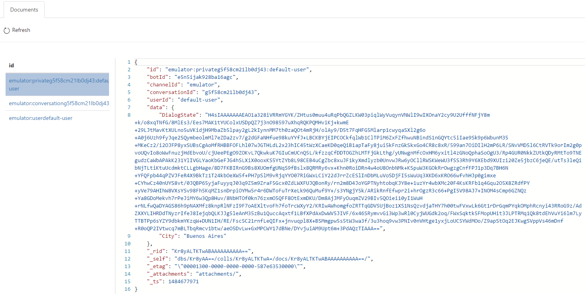

# Custom State API Bot Sample

A stateless sample bot tracking context of a conversation using a custom storage provider.

[![Deploy to Azure][Deploy Button]][Deploy CSharp/CustomState]

[Deploy Button]: https://azuredeploy.net/deploybutton.png
[Deploy CSharp/CustomState]: https://azuredeploy.net

### Prerequisites

The minimum prerequisites to run this sample are:
* The latest update of Visual Studio 2015. You can download the community version [here](http://www.visualstudio.com) for free.
* The Bot Framework Emulator. To install the Bot Framework Emulator, download it from [here](https://emulator.botframework.com/). Please refer to [this documentation article](https://github.com/microsoft/botframework-emulator/wiki/Getting-Started) to know more about the Bot Framework Emulator.
* The Azure DocumentDB Emulator. To install the Azure DocumentDB Emulator, download it from [here](https://aka.ms/documentdb-emulator). Please refer to [this documentation article](https://docs.microsoft.com/en-us/azure/documentdb/documentdb-nosql-local-emulator) to know more about the Azure DocumentDB Emulator.

### Code Highlights

The Bot Framework provides several ways of persisting data relative to a user or conversation. Behind the scenes the Bot Framework uses the Bot State Service for tracking context of a conversation. This allows the creation of stateless Bot web services so that they can be scaled.

There might be times when a custom storage wants to be used. Reasons for wanting this could be many, however the most common ones are:

* **Geographic Affinity**: Users can create their storage service (e.g. Azure Tables or Azure DocumentDB) in regions geographically close to their other services, minimizing latencies and improving user experience
* **Geo-replication & Redundancy**: Different storage services might provide varying degrees of redundancy, high availability, disaster recovery and geographic replication, which users might prefer (e.g. Azure Tables and Azure DocumentDB)
* **Data ownership / Compliance**: Company policies and regulations may require the data to be in an account owned by the company
* **Leveraging data**: Users may benefit from having their own data available for querying or feeding into other processes such as analytics, etc.

This bot is based on the [State bot](../core-State), with the addition that it uses a custom storage for tracking the context of a conversation. In this case, we are storing the bot state in DocumentDB by using the [`DocumentDbBotDataStore`](https://github.com/Microsoft/BotBuilder-Azure/blob/master/CSharp/Library/Microsoft.Bot.Builder.Azure/DocumentDbBotDataStore.cs) provided in the [BotBuilder SDK Azure Extensions](https://www.nuget.org/packages/Microsoft.Bot.Builder.Azure/) NuGet package.

Check out the creation and registration in the Autofac container of the [`DocumentDbBotDataStore`](https://github.com/Microsoft/BotBuilder-Azure/blob/master/CSharp/Library/Microsoft.Bot.Builder.Azure/DocumentDbBotDataStore.cs) in the [`Global.asax.cs`](Global.asax.cs#L24-L28). By default the `DocumentDbBotDataStore` will be created using the endpoint and auth key of the Azure DocumentDB Emulator. These settings are stored in the [`Web.config`](Web.config#L12-L13) and can be edited to use your DocumentDB database.

Also, checkout the registration of the [`AzureModule`](https://github.com/Microsoft/BotBuilder-Azure/blob/master/CSharp/Library/Microsoft.Bot.Builder.Azure/AzureModule.cs), used to bundle up a set of required components

````C#
protected void Application_Start()
{
    Uri docDbServiceEndpoint = new Uri(ConfigurationManager.AppSettings["DocumentDbServiceEndpoint"]);
    string docDbEmulatorKey = ConfigurationManager.AppSettings["DocumentDbAuthKey"];

    Conversation.UpdateContainer(builder =>
    {
        builder.RegisterModule(new AzureModule(Assembly.GetExecutingAssembly()));

        var store = new DocumentDbBotDataStore(docDbServiceEndpoint, docDbEmulatorKey);
        builder.Register(c => store)
            .Keyed<IBotDataStore<BotData>>(AzureModule.Key_DataStore)
            .AsSelf()
            .SingleInstance();

    });

    GlobalConfiguration.Configure(WebApiConfig.Register);
}
````

### Outcome

The sample itself will behave exactly as the [State bot](../core-State) with the difference that the bot state is being stored in DocumentDB.

After running the sample, go to the [Azure DocumentDB Emulator Data Explorer](https://localhost:8081/_explorer/index.html#) to check the documents that were stored in DocumentDB. Different Documents are created depending on the bot store type being used. 

The samples uses the three bot store types (UserData, ConversationData and PrivateConversationData), so three documents will appear in the DocumentDB collection.



Each of the documents contains the information related to the bot store type:

| UserData| ConversationData | PrivateConversationData |
|----------|-------|----------|
||||

### More Information

To get more information about how to get started in Bot Builder for .NET and State please review the following resources:
* [Bot Builder for .NET](https://docs.microsoft.com/en-us/bot-framework/dotnet/)
* [Bot Builder SDK Azure Extensions](https://github.com/Microsoft/BotBuilder-Azure)
* [Manage conversational state](https://docs.microsoft.com/en-us/bot-framework/dotnet/bot-builder-dotnet-state)
* [State sample](../core-State)
* [IDialogContext Interface](https://docs.botframework.com/en-us/csharp/builder/sdkreference/d1/dc6/interface_microsoft_1_1_bot_1_1_builder_1_1_dialogs_1_1_i_dialog_context.html)
