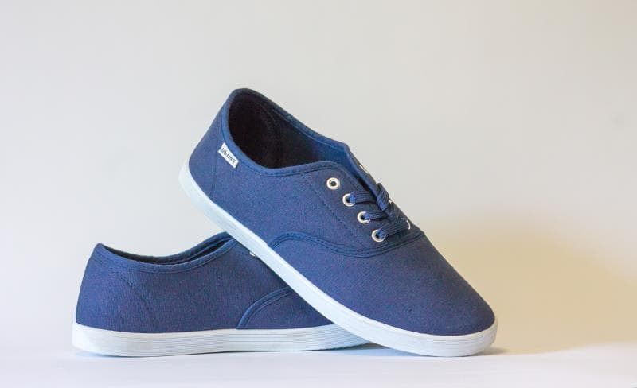
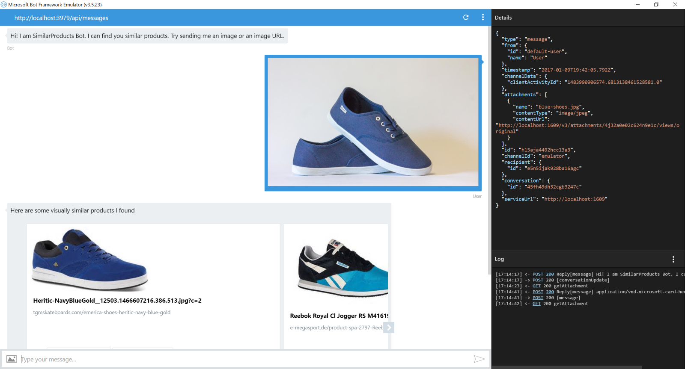

# Similar Products Bot Sample

A sample bot that illustrates how to use the [Bing Image Search API](https://www.microsoft.com/cognitive-services/en-us/bing-image-search-api) to find visually similar products from an image stream or a URL.[Here's](https://docs.botframework.com/en-us/bot-intelligence/search/#example-product-bot) a demo of this bot in a web chat.

[![Deploy to Azure][Deploy Button]][Deploy CSharp/SimilarProducts]

[Deploy Button]: https://azuredeploy.net/deploybutton.png
[Deploy CSharp/SimilarProducts]: https://azuredeploy.net

### Prerequisites

The minimum prerequisites to run this sample are:
* The latest update of Visual Studio 2015. You can download the community version [here](http://www.visualstudio.com) for free.
* The Bot Framework Emulator. To install the Bot Framework Emulator, download it from [here](https://emulator.botframework.com/). Please refer to [this documentation article](https://github.com/microsoft/botframework-emulator/wiki/Getting-Started) to know more about the Bot Framework Emulator.
* Subscribe [here](https://azure.microsoft.com/en-us/try/cognitive-services/my-apis/?apiSlug=search-api-v7) to obtain your own key and update the `BingSearchApiKey` key in [Web.config](Web.config) file to try it out further.

````XML
  <appSettings>
    <add key="BingSearchApiKey" value="PUT-YOUR-OWN-API-KEY-HERE" />
  </appSettings>
````

### Code Highlights
The main logic that handles calling the Bing Image Search API can be found in [BingImageSearchService.cs](Services/BingImageSearchService.cs).

The first method `GetSimilarProductImagesAsync(string url)` illustrates how to get the list of visually similar product from a URL. The image URL is encoded and sent in the get request query parameters (`imgUrl`):

````C#
/// <summary>
/// Gets a list of visually similar products from an image URL.
/// </summary>
/// <param name="url">The URL of an image.</param>
/// <returns>List of visually similar images.</returns>
public async Task<IList<ImageResult>> GetSimilarProductImagesAsync(string url)
{
    using (var httpClient = new HttpClient())
    {
        httpClient.DefaultRequestHeaders.Add("Ocp-Apim-Subscription-Key", ApiKey);

        string apiUrl = BingApiUrl + $"&imgUrl={HttpUtility.UrlEncode(url)}";

        var text = await httpClient.GetStringAsync(apiUrl);
        var response = JsonConvert.DeserializeObject<BingImageResponse>(text);

        return response?.VisuallySimilarProducts?.Select(i => new ImageResult
            {
                HostPageDisplayUrl = i.HostPageDisplayUrl,
                HostPageUrl = i.HostPageUrl,
                Name = i.Name,
                ThumbnailUrl = i.ThumbnailUrl,
                WebSearchUrl = i.WebSearchUrl
            })
            .ToList();
    }
}
````

The second method `GetSimilarProductImagesAsync(Stream stream)` illustrates how to get the list of visually similar product from a stream. The main difference here is that the image content is posted in the request body:

```C#
/// <summary>
/// Gets a list of visually similar products from an image stream.
/// </summary>
/// <param name="stream">The stream to an image.</param>
/// <returns>List of visually similar images.</returns>
public async Task<IList<ImageResult>> GetSimilarProductImagesAsync(Stream stream)
{
    using (var httpClient = new HttpClient())
    {
        httpClient.DefaultRequestHeaders.Add("Ocp-Apim-Subscription-Key", ApiKey);

        var strContent = new StreamContent(stream);
        strContent.Headers.ContentDisposition = new ContentDispositionHeaderValue("form-data") { FileName = "Any-Name-Works" };

        var content = new MultipartFormDataContent();
        content.Add(strContent);

        var postResponse = await httpClient.PostAsync(BingApiUrl, content);
        var text = await postResponse.Content.ReadAsStringAsync();
        var response = JsonConvert.DeserializeObject<BingImageResponse>(text);

        return response?.VisuallySimilarProducts?.Select(i => new ImageResult
            {
                HostPageDisplayUrl = i.HostPageDisplayUrl,
                HostPageUrl = i.HostPageUrl,
                Name = i.Name,
                ThumbnailUrl = i.ThumbnailUrl,
                WebSearchUrl = i.WebSearchUrl
            })
            .ToList();
    }
}
```

### Outcome

You will see the following when connecting the Bot to the Emulator and send it an image or a URL:

Input:



Output:



### More Information

To get more information about how to get started in Bot Builder for .NET and Microsoft Bing Images Search API please review the following resources:
* [Bot Builder for .NET](https://docs.microsoft.com/en-us/bot-framework/dotnet/)
* [Microsoft Bing Image Search API](https://www.microsoft.com/cognitive-services/en-us/bing-image-search-api)
* [Microsoft Bing Image Search API Reference](https://msdn.microsoft.com/en-us/library/dn760791.aspx)
